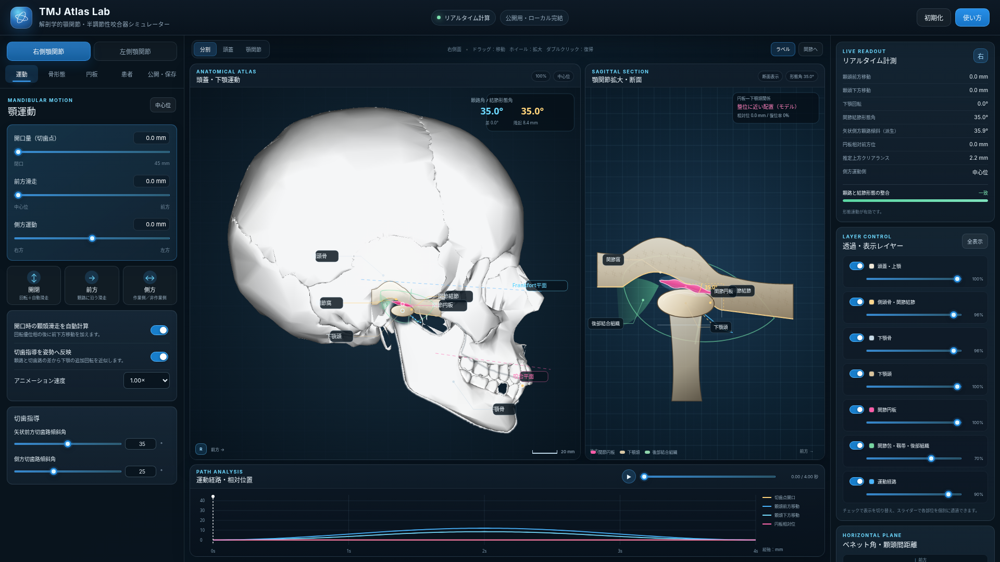

# TMJ Atlas Lab

**頭蓋・側頭骨・関節結節・下顎頭・関節円板を左右別に変更できる、一般公開用の静的Webシミュレーターです。**



## すぐに使う

### 単一HTML版

`tmj-atlas-lab-standalone.html` をブラウザーで開いてください。画像、CSS、JavaScriptをすべて内包しており、サーバーやインストールは不要です。

### 通常版

`index.html`、`styles.css`、`app.js`、`assets/` を同じ階層のままWebサーバーへ配置してください。GitHub Pages、一般的なレンタルサーバー、静的ホスティングで動作します。

ローカルサーバーを使う例：

```bash
python -m http.server 8000
```

その後、ブラウザーで `http://localhost:8000/` を開きます。

## 主な実装内容

### 1. 解剖図をレイヤー分離した頭蓋側面ビュー

- 頭蓋・上顎
- 側頭骨・関節窩・関節結節
- 可動下顎骨と下顎歯列
- 可変形状の下顎頭
- 関節円板
- 関節包、外側靱帯、後部結合組織
- 顆頭・円板・切歯点の運動経路
- Frankfort平面、咬合平面

各レイヤーは個別に表示／非表示、0〜100%の透過度変更が可能です。X線様表示、断面表示、基準形態ゴースト、注目部位の自動ズームにも対応します。

### 2. 顆路傾斜角を関節結節の形態へ反映

「関節結節形態へ連動」が有効な場合、矢状前方顆路傾斜角 `θ` と関節結節の有効前後長 `L` から、結節の隆起量 `H` を次式で求め、側頭骨の関節面を描き直します。

```text
H = L × tan(θ)
```

連動を解除すると、

- 顆頭が移動する仮想顆路角
- 関節結節そのものの形態角

を独立に設定できます。両者が一致しない場合は、運動経路と骨表面の差を色分けして表示します。

### 3. 左右別の下顎頭形態

左右それぞれについて次を設定できます。

- 前後径
- 上下径
- 内外側径
- 楕円型
- 円形型
- 扁平型
- 嘴状型
- 非対称型
- 皮質輪郭の扁平化率
- 顎関節中心の前後・上下位置補正

内外側径と顆頭間距離は、右パネルの水平面ビューにも反映されます。

### 4. 関節円板の形態と相対運動

左右それぞれについて次を設定できます。

- 前方肥厚部の厚み
- 中間狭窄部の厚み
- 後方肥厚部の厚み
- 円板前後長
- 円板の前方／後方偏位
- 円板の扁平化・変形率
- 運動追従率
- 復位の有無
- 復位開始の顆頭移動量
- 初期回転
- 上関節腔
- 後部結合組織の伸展性
- 関節包の弛緩度

復位ありモデルでは、顆頭の前方移動量が設定閾値を超えると、追従率に応じて円板―下顎頭間の相対偏位を連続的に減少させます。これは教育的な運動モデルであり、MRI所見や臨床診断を自動判定するものではありません。

### 5. 顎運動

- 開口運動
- 前方運動
- 左右側方運動
- 作業側／非作業側の表示
- ベネット角
- 即時側方移動
- 作業側顆頭の進行性外側移動
- 矢状側方顆路傾斜の派生表示
- 矢状前方切歯路傾斜角
- 側方切歯路傾斜角
- 自動アニメーション
- 運動タイムライン

矢状側方顆路傾斜は直接調節値とせず、矢状前方顆路傾斜角とベネット角から三次元経路の矢状面投影角として算出して表示します。

開口回転は、切歯点開口量 `d` と蝶番軸―切歯点距離 `R` から、概略的に次式で算出します。

```text
回転角 = 2 × asin(d / (2R))
```

開口時の顆頭滑走を有効にすると、初期回転相の後に前下方移動を加えます。側方運動では、選択側が作業側か非作業側かを判定し、非作業側の前内下方移動とベネット角を水平面図へ反映します。

### 6. 患者・頭蓋情報

- 頭蓋前後径比
- 頭蓋上下径比
- 下顎体長比
- 下顎枝高比
- 顆頭間距離
- 蝶番軸―切歯点距離
- 咬合平面傾斜
- 左右顎関節中心の位置補正

これらは、参照頭蓋図の表示比率、下顎の可動レイヤー、運動計算、水平面図に反映されます。

### 7. 公開・共有機能

- 症例設定のJSON保存・読込
- 状態をURLハッシュへ格納する共有URL
- 頭蓋図、顎関節断面、主要計測値をまとめたPNG保存
- 外部ライブラリなし
- サーバーへのデータ送信なし
- 単一HTML版あり

## ファイル構成

```text
tmj-anatomy-simulator/
├─ index.html                         通常版の入口
├─ styles.css                         UIスタイル
├─ app.js                             シミュレーション、描画、保存処理
├─ tmj-atlas-lab-standalone.html      画像・CSS・JS内包版
├─ preview.png                        画面プレビュー
├─ README.md
├─ NOTICE.md
├─ LICENSE-CODE.txt
├─ ASSET-LICENSE.md
├─ build_assets.py                    参照画像のレイヤー分離スクリプト
├─ build_standalone.py                単一HTML生成スクリプト
└─ assets/
   ├─ cranium-lateral.png
   ├─ mandible-body-lateral.png
   ├─ lower-teeth-lateral.png
   ├─ skull-full-alpha.png
   ├─ skull-ghost-lateral.png
   ├─ source-skull-lateral.png
   └─ source-mandible-highlight.png
```

## 再ビルド

参照画像からレイヤーを再生成：

```bash
python build_assets.py
```

通常版から単一HTML版を再生成：

```bash
python build_standalone.py
```

`build_assets.py` には Pillow と NumPy が必要です。シミュレーター本体の実行にはPythonは不要です。

## 動作確認

- Chromium系ブラウザーで初期表示、左右切替、各スライダー、レイヤー透過、表示レイアウト、円板偏位プリセット、運動アニメーションを確認
- JavaScript構文検査済み
- 1920 × 1080、1220 px程度までのデスクトップ幅に対応

スマートフォンよりも、横幅のあるPCまたはタブレットでの使用を推奨します。

## 精度と使用上の注意

このアプリは、解剖学・補綴学・顎運動学の説明を目的とする**可変形状の視覚モデル**です。次は行いません。

- CT・CBCT・MRIデータからの患者固有形状再構成
- 歯面同士の三次元接触判定
- 咬合干渉・離開量・接触圧の有限要素解析
- 関節円板、靱帯、関節包の材料力学解析
- 筋活動、疼痛、関節雑音、炎症の推定
- 円板転位や変形性顎関節症の診断
- 実在する特定メーカー咬合器の機械公差再現

実患者の診断、治療計画、補綴物製作、法的・医学的判断の根拠には使用しないでください。

## 解剖画像とライセンス

頭蓋・下顎の参照画像は BodyParts3D / Anatomography（© The Database Center for Life Science）に由来します。元画像と本配布物内の加工画像レイヤーは **CC BY-SA 2.1 Japan** の条件で扱います。詳細は `NOTICE.md` と `ASSET-LICENSE.md` を参照してください。

アプリケーションコード（HTML、CSS、JavaScript、Pythonビルドスクリプト）は `LICENSE-CODE.txt` のMIT Licenseです。画像レイヤーにはMIT Licenseは適用されません。
